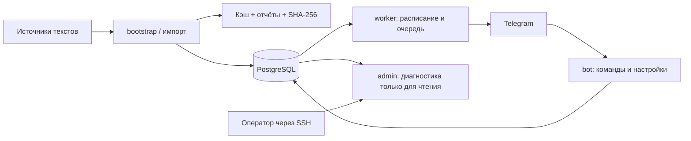

# Архитектура

Python 3.12+, aiogram, PostgreSQL 16, FastAPI и Docker Compose. Бот получает обновления Telegram через long polling; входящий webhook не требуется. Redis, платный Bible API и генеративная модель не используются.

## Процессы

| Компонент | Точка входа | Обязанности |
|---|---|---|
| `postgres` | Образ PostgreSQL | Постоянное состояние корпуса, пользователей и очереди. |
| `bootstrap` | `python -m app.bootstrap` | Миграции, справочники, необязательный импорт и полный аудит перед запуском. Завершается после выполнения. |
| `bot` | `python -m app.bot.main` | Telegram polling, авторизация, команды и меню. |
| `worker` | `python -m app.worker.main` | Поиск наступивших подписок, подготовка неизменных частей, отправка и фиксация прогресса. |
| `admin` | `uvicorn app.web.main:app` | `/health`, `/ready`, `/admin`, `/api/stats`; настройки через веб не меняются. |

Compose ждёт healthy PostgreSQL и успешного bootstrap для штатного запуска приложения. Runtime удерживает shared advisory lock обслуживания в БД; миграции и импорт требуют exclusive lock. Поэтому импорт выполняется после остановки `bot`, `worker` и `admin`. Кэш дополнительно защищён файловой блокировкой; одновременные экземпляры одной службы координируются в пределах одной БД.

## Путь текста

Каталог → проверка прав конкретного издания → ограниченная HTTPS-загрузка → кэш исходных байтов и SHA-256 → строгий разбор формата → аудит структуры → одна транзакция на издание → проверка записанных строк/хеша → сведения о происхождении и отчёт.

Модули `app/catalog/multisource/` разделены на конфигурацию (`types`), транспорт (`transport`), лицензии (`licenses`), адаптеры (`sources`), разбор (`parsers`), сохранение (`store`), оркестрацию (`runner`) и CLI. Старый `run_import` делегирует современному runner; параллельной отдельной БД для нового импорта нет.

Успешно записанные издания сохраняются при отказе другого источника. Повторный импорт не сбрасывает настройки и прогресс. Изменившийся текст используемого издания удерживается для решения оператора. Зеркала могут объединяться лишь при совместимости содержания, языка, нумерации и атрибуции; их ID остаются в `translation_sources`.

## Состояние приложения

`app/services/` содержит работу с назначениями, Библией, планами, временем, форматированием и блокировками. `telegram_chats` хранит настройки каждого назначения, `subscriptions` — расписания, `delivery_log` — задания и подтверждённые части. Модель БД описана в [DATABASE.md](DATABASE.md).

Очередь отделяет подготовку текста от сетевой отправки. Прогресс меняется после подтверждённого отрывка. Неоднозначный результат Telegram переходит в `uncertain` и не повторяется автоматически; уже опубликованное сообщение нельзя откатить транзакцией PostgreSQL. Решение оператора фиксируется в журнале.

Нумерация — часть идентичности перевода. Нормализованная нумерация BibleNLP и native-нумерация других источников не считаются взаимозаменяемыми. Поиск, случайный выбор и последовательное чтение используют строки выбранного издания. Тематические ссылки требуют проверенного соответствия; для native они отключены.

## Границы инфраструктуры

PostgreSQL не публикуется на хосте. Admin доступен через loopback и SSH-туннель. Приложение работает под непривилегированным пользователем контейнера, без capabilities, с `no-new-privileges`. Compose задаёт лимиты ресурсов и ротацию Docker-логов. Это одна установка на одном хосте, без заявленной высокой доступности или автоматического масштабирования. Подробности — [SECURITY.md](SECURITY.md) и [LIMITATIONS.md](LIMITATIONS.md).
